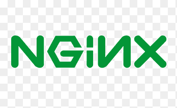

# Django_Project_CICD_Automation-using-Github_Actions-Jenkins-Ansible-Azure_Cloud




- Django CI/CD Automation using ***Github Actions***, ***Jenkins***, ***Ansible***, ***Azure Cloud***
- This Project Demonstrates how a Django code will move along the various phases or stages in CI/CD lifecycle, before it is delivered to the customer or before it is live on   Azure Cloud Production server using Github Actions and other ***DevOps Tools***.


#### Step1 : Testing Phase(CI)

- Once the code is pushed to the github repository, it undergoes through ***unit testing*** by github actions

#### Step2 : Code Quality Check(CI)

- Once all testcases are passed successfully, it will check Django code base against coding style (PEP8), programming errors like “library imported but unused” and “Undefined name" etc using ***linting tool*** called ***flake8***

#### Step3 : Build Phase using Jenkins(CD)

- As soon as codes gets pushed to our repository, github will notify our ***jenkins server(master server in Azure Cloud)*** about push event through webhook
- jenkins will trigger ***build job*** defined in its server
- Django Code base will be cloned/pulled to jenkins workspace

#### Step4 : Deploy and Operate Phase using Ansible(CD)

- Once jenkins have code in workspace it will get deployed to slave servers such as ***Production, QA1, QA2 servers** using ***Ansible*** which is ***configuration management, and application-deployment tool.***
- Ansible will install ***Nginx Web Server*** to slave server and all the configuration file will be placed whereever you mentioned it to be from master sever using **SSH Connection** and nginx service will be started
- then it will install ***MySQL Server*** and create database with specified user and passsword 
- then it will install all requirements packages, migrate our migrations to database using migrate command specified in ansible, collects static files to one folder etc 
- then It will install ***Gunicorn*** which is ***Application Server*** for django and all the configuration files and service files for gunicorn will be copied from jenkins server to slave server and ansible will invoke gunicorn server and starts our django app
- This phase will be completed within few seconds for all the slave servers specified in the jenkins jobs 

- so whenever you commit new code to repo it CI/CD pipeline will make sure that it has ```passed all testcases```, ```it follows PEP8 coding quality rules```, ```your Nginx web server is running properly```, ```your database server is up and running properly```, ```Gunicorn App Server is running properly```, ```install new packages from requirements.txt file```, ```migrates new migrations files to database``` and these many tasks our performed in few seconds and that too for multiple servers
